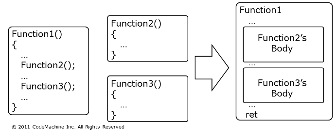
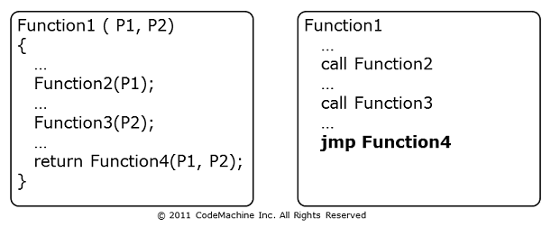
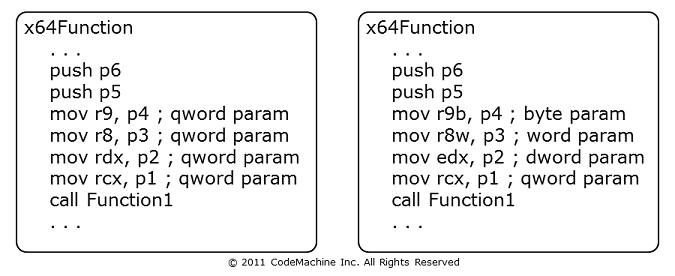
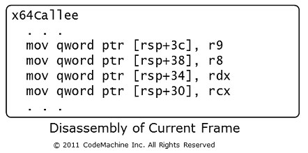
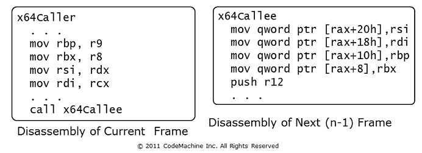

# 前言

第一次完整地翻译一篇技术文章，体会颇深，自己阅读英文的技术文章觉得蛮轻松，可是，完整的翻译出来，使得语句尽量通顺、得体，再加上垒这么多文字，并非一件轻松的事。其中，有些地方个人觉得不是那么好翻译，就保留了原文的名称，望见谅。鉴于个人的翻译能力有限，文中可能出现不少语句不通、甚至错译的地方，可以及时告诉译者，方便纠正。

E-mail: [michael_du@trendmicro.com.cn](michael_du@trendmicro.com.cn)

原文链接：[http://www.codemachine.com/article_x64deepdive.html](http://www.codemachine.com/article_x64deepdive.html)

建议各位有兴趣的话，认真阅读一下原文，个人觉得整理的还是挺好的。

在正式开始这篇译文之前，译者先定义下面两个关于栈帧的翻译：

- frame pointer：栈帧寄存器、栈帧指针，在X86平台上，是EBP所指的位置
- stack pointer：栈顶寄存器、栈顶指针，在X86平台上，是ESP所指的位置

这个教程讨论一些在X64 CPU上代码执行的要点，如：编译器优化、异常处理、参数传递和参数恢复，并且介绍这几个topic之间的关联。我们会涉及与上述topic相关的一些重要的调试命令，并且提供必要的背景知识去理解这些命令的输出。同时，也会重点介绍X64平台的调试与X86平台的不同，以及这些不同对调试的影响。最后，我们会活学活用，利用上面介绍的知识来展示如何将这些知识应用于X64平台的基于寄存器存储的参数恢复上，当然，这也是X64平台上调试的难点。

# 编译器优化

这一节主要讨论影响X64 code生成的编译器优化，首先从X64寄存器开始，然后，介绍优化细节，如：函数内联处理（function in-lining）,消除尾部调用（tail call elimination）, 栈帧指针优化（frame pointer optimization）和基于栈顶指针的局部变量访问（stack pointer based local variable access）。

## 寄存器的变化

X64平台上的所有寄存器，除了段寄存器和EFlags寄存器，都是64位的，这就意味着在x64平台上所有内存的操作都是按64位宽度进行的。同样，X64指令有能力一次性处理64位的地址和数据。增加了8个新的寄存器，如：r8~r15，与其他的使用字母命名的寄存器不同，这些寄存器都是使用数字命名。下面的调试命令输出了X64平台上寄存器的信息：

```
1: kd> r
rax=fffffa60005f1b70 rbx=fffffa60017161b0 rcx=000000000000007f
rdx=0000000000000008 rsi=fffffa60017161d0 rdi=0000000000000000
rip=fffff80001ab7350 rsp=fffffa60005f1a68 rbp=fffffa60005f1c30
 r8=0000000080050033  r9=00000000000006f8 r10=fffff80001b1876c
r11=0000000000000000 r12=000000000000007b r13=0000000000000002
r14=0000000000000006 r15=0000000000000004
iopl=0         nv up ei ng nz na pe nc
cs=0010  ss=0018  ds=002b  es=002b  fs=0053  gs=002b             efl=00000282
nt!KeBugCheckEx:
fffff800`01ab7350 48894c2408      mov     qword ptr [rsp+8],rcx ss:0018:fffffa60`005f1a70=000000000000007f
```

相比较X86平台，一些寄存器的用法已经发生变化，这些变化可以按如下分组：

1.	非易失性寄存器是那些在函数调用过程中，值被保存起来的寄存器。X64平台拥有一个扩展的非易失性寄存器集合，在这个集合中，以前x86平台下原有的非易失性寄存器也包含在内，新增的寄存器是从R12到R15，这些寄存器对于函数参数的恢复很重要。

2.	Fastcall寄存器用于传递函数参数。Fastcall是X64平台上默认的调用约定，前4个参数通过RCX, RDX, R8, R9传递。

3.	RBP不再用作栈帧寄存器。现在RBP和RBX,RCX一样都是通用寄存器，调试前不再使用RBP来回溯调用栈。

4.	在X86 CPU中，FS段寄存器用于指向线程环境块（TEB）和处理器控制区（Processor Control Region, KPCR），但是，在X64上，GS段寄存器在用户态是指向TEB，在内核态是指向KPCR。然而，当运行WOW64程序中，FS寄存器仍然指向32位的TEB。

在X64平台上，trap frame的数据结构(nt!_KTRAP_FRAME)中不包含非易失性寄存器的合法内容。如果X64函数会使用到这些非易失性寄存器，那么，指令的序言部分会保存非易失性寄存器的值。这样，调试器能够一直从栈中取到这些非易失性寄存器原先的值，而不是从trap frame中去取。在X64内核模式调试状态下，`.trap`命令的输出会打印一个NOTE，用于告诉用户所有从trap frame中取出的寄存器信息可能不准确，如下所示：

```
1: kd> kv
Child-SP          RetAddr           : Args to Child
. 
. 
.
nt!KiDoubleFaultAbort+0xb8 (TrapFrame @ fffffa60`005f1bb0)
. 
. 
.

1: kd> .trap  fffffa60`005f1bb0
NOTE: The trap frame does not contain all registers.
Some register values may be zeroed or incorrect
```

## 函数内联处理（Function in-lining）

如果满足一定的规则以后，X64编译器会执行内联函数的扩展，这样会将所有内联函数的调用部分用函数体来替换。内联函数的优点是避免函数调用过程中的栈帧创建以及函数退出时的栈平衡，缺点是由于指令的重复对导致可执行程序的大小增大不少，同时，也会导致cache未命中和page fault的增加。内联函数同样也会影响调试，因为当用户尝试在内联函数上设置断点时，调试器是不能找到对应的符号的。源码级别的内联可以通过编译器的/Ob flag进行控制，并且可以通过__declspec(noinline)禁止一个函数的内联过程。图1显示函数2和函数3被内联到函数1的过程。



## 消除尾部调用（Tail Call Elimination）

X64编译器可以使用jump指令替换函数体内最后的call指令，通过这种方式来优化函数的调用过程。这种方法可以避免被调函数的栈帧创建，调用函数与被调函数共享相同的栈帧，并且，被调函数可以直接返回到自己爷爷级别的调用函数，这种优化在调用函数与被调函数拥有相同参数的情况下格外有用，因为如果相应的参数已经被放在指定的寄存器中，并且没有改变，那么，它们就不用被重新加载。图2显示了TCE，我们在函数1的最后调用函数4：



## 栈帧指针省略（Frame Pointer Omission, FPO）

在X86平台下，EBP寄存器用于访问栈上的参数与局部变量，而在X64平台下，RBP寄存器不再使用充当同样的作用。取而代之的是，在X64环境下，使用RSP作为栈帧寄存器和栈顶寄存器，具体是如何使用的，我们会在后续的章节中做详细的叙述。（译者注：请区分X86中的FPO与X64中的FPO，有很多相似的地方，也有不同之处。关于X86上的FPO，请参考《软件调试》中关于栈的描述）所以，在X64环境下，RBP寄存器已经不再担当栈帧寄存器，而是作为一般的通用寄存器使用。但是，有一个例外情况，当使用alloca()动态地在栈上分配空间的时候，这时，会和X86环境一样，使用RBP作为栈帧寄存器。

下面的汇编代码片段展示了X86环境下的KERNELBASE!Sleep函数，可以看到EBP寄存器被用作栈帧寄存器。当调用SleepEx()函数的时候，参数被压到栈上，然后，使用call指令调用SleepEx()。

```
0:009> uf KERNELBASE!Sleep
KERNELBASE!Sleep:
75ed3511 8bff            mov     edi,edi
75ed3513 55              push    ebp
75ed3514 8bec            mov     ebp,esp
75ed3516 6a00            push    0
75ed3518 ff7508          push    dword ptr [ebp+8]
75ed351b e8cbf6ffff      call    KERNELBASE!SleepEx (75ed2beb)
75ed3520 5d              pop     ebp
75ed3521 c20400          ret     4.
```

下面的代码片段展示的是X64环境下相同的函数，与X86的code比起来有明显的不同。X64版本的看起来非常紧凑，主要是由于不需要保存、恢复RBP寄存器。

```
0:000> uf KERNELBASE!Sleep
KERNELBASE!Sleep:
000007fe`fdd21140 xor     edx,edx
000007fe`fdd21142 jmp     KERNELBASE!SleepEx (000007fe`fdd21150)
```

## 基于栈顶指针的局部变量访问（Stack Pointer based local variable access）

在X86平台上，EBP的最重要作用就是可以通过EBP访问实参和局部变量，而在X64平台上，如我们前面所述，RBP寄存器不再充当栈帧寄存器的作用，所以，在X64平台上，RSP即充当栈帧寄存器(frame pointer)，又充当栈顶寄存器(stack pointer)。所以，X64上所有的引用都是基于RSP的。由于这个原因，依赖于RSP的函数，其栈帧在函数体执行过程中是固定不变的，从而可以方便访问局部变量和参数。因为PUSH和POP指令会改变栈顶指针，所以，X64函数会限制这些指令只能在函数的首尾使用。如图3所示，X64函数的结构：


下面的代码片段展示了函数user32!DrawTestExW的完整信息，这个函数的首部以指令“sub rsp,48h”结束，尾部以“add rsp,48h”开始。因为首尾之间的指令通过RSP访问栈上的内容，所以，没有PUSH或者POP之类的指令在函数体内。

```
0:000> uf user32!DrawTextExW
user32!DrawTextExW:
00000000`779c9c64 sub     rsp,48h
00000000`779c9c68 mov     rax,qword ptr [rsp+78h]
00000000`779c9c6d or      dword ptr [rsp+30h],0FFFFFFFFh
00000000`779c9c72 mov     qword ptr [rsp+28h],rax
00000000`779c9c77 mov     eax,dword ptr [rsp+70h]
00000000`779c9c7b mov     dword ptr [rsp+20h],eax
00000000`779c9c7f call    user32!DrawTextExWorker (00000000`779ca944)
00000000`779c9c84 add     rsp,48h
00000000`779c9c88 ret
```

# 异常处理（Exception Handling）

这一节讨论X64函数用于异常处理的底层机制和数据结构，以及调试器如何使用这些数据结构回溯调用栈的，同时，也介绍一些X64调用栈上特有的内容。

## RUNTIME_FUNCTION

X64可执行文件使用了一种PE文件格式的变种，叫做PE32+，这种文件有一个额外的段，叫做“.pdata”或者Exception Directory，用于存放处理异常的信息。这个“Exception Directory”包含一系列RUNTIME_FUNCTION 结构，每一个non-leaf函数都会有一个RUNTIME_FUNCTION，这里所谓的non-leaf函数是指那些不再调用其他函数的函数。每一个RUNTIME_FUNCTION结构包含函数第一条指令和最后一条指令的偏移，以及一个指向unwind information结构的指针。Unwind information结构用于描述在异常发生的时候，函数调用栈该如何展开。

图4展示了一个模块的RUNTIME_FUNCTION结构。


下面的汇编代码片段展示了X86平台与X64平台上异常处理的不同。在X86平台上，当高级语言使用了结构化异常处理，编译器会在函数的首尾生成特定的代码片段，用于在运行时构建异常栈帧。这些可以在下面的代码片段中看到，如：调用了ntdll!_SEH_prolog4和 ntdll!_SEH_epilog4.

```
0:009> uf ntdll!__RtlUserThreadStart
ntdll!__RtlUserThreadStart:
77009d4b push    14h
77009d4d push    offset ntdll! ?? ::FNODOBFM::`string'+0xb5e (76ffc3d0)
77009d52 call    ntdll!_SEH_prolog4 (76ffdd64)
77009d57 and     dword ptr [ebp-4],0
77009d5b mov     eax,dword ptr [ntdll!Kernel32ThreadInitThunkFunction (770d4224)]
77009d60 push    dword ptr [ebp+0Ch]
77009d63 test    eax,eax
77009d65 je      ntdll!__RtlUserThreadStart+0x25 (77057075)

ntdll!__RtlUserThreadStart+0x1c:
77009d6b mov     edx,dword ptr [ebp+8]
77009d6e xor     ecx,ecx
77009d70 call    eax
77009d72 mov     dword ptr [ebp-4],0FFFFFFFEh
77009d79 call    ntdll!_SEH_epilog4 (76ffdda9)
77009d7e ret     8
```

然而，在X64环境上的相同函数中，没有任何迹象表明当前函数使用了结构化异常处理，因为没有运行时的异常栈帧。通过从可执行文件中提取相应的信息，可以使用RUNTIME_FUNCTION结构和RIP一起确定相应的异常处理信息。

```
0:000> uf ntdll!RtlUserThreadStart
Flow analysis was incomplete, some code may be missing
ntdll!RtlUserThreadStart:
00000000`77c03260 sub     rsp,48h
00000000`77c03264 mov     r9,rcx
00000000`77c03267 mov     rax,qword ptr [ntdll!Kernel32ThreadInitThunkFunction (00000000`77d08e20)]
00000000`77c0326e test    rax,rax
00000000`77c03271 je      ntdll!RtlUserThreadStart+0x1f (00000000`77c339c5)

ntdll!RtlUserThreadStart+0x13:
00000000`77c03277 mov     r8,rdx
00000000`77c0327a mov     rdx,rcx
00000000`77c0327d xor     ecx,ecx
00000000`77c0327f call    rax
00000000`77c03281 jmp     ntdll!RtlUserThreadStart+0x39 (00000000`77c03283)

ntdll!RtlUserThreadStart+0x39:
00000000`77c03283 add     rsp,48h
00000000`77c03287 ret

ntdll!RtlUserThreadStart+0x1f:
00000000`77c339c5 mov     rcx,rdx
00000000`77c339c8 call    r9
00000000`77c339cb mov     ecx,eax
00000000`77c339cd call    ntdll!RtlExitUserThread (00000000`77bf7130)
00000000`77c339d2 nop
00000000`77c339d3 jmp     ntdll!RtlUserThreadStart+0x2c (00000000`77c53923)
```

## UNWIND_INFO和UNWIND_CODE

RUNTIME_FUNCTION结构的BeginAddress和EndAddress存放着虚拟地址空间上的函数首地址和尾地址所对应的偏移，这些偏移是相对于模块基址的。当函数产生异常时，OS会扫描内存中PE，寻找当前指令地址所在的RUNTIME_FUNCTION结构。UnwindData域指向另外一个结构，用于告诉OS如何去展开栈。这个UNWIND_INFO结构包含各种UNWIND_CODE结构，每一个UNWIND_CODE都代表函数首部对应的操作。

对于动态生成的代码，OS支持下面两个函数RtlAddFunctionTable() and RtlInstallFunctionTableCallback()，可以用于在运行过程中创建RUNTIME_FUNCTION 。

图5展示RUNTIME_FUNCTION和UNWIND_INFO的关系


调试器命令“.fnent”可以显示指定函数的RUNTIME_FUNCTIOIN结构，下面的例子，使用”.fnent”显示ntdll!RtlUserThreadStart

```
0:000> .fnent ntdll!RtlUserThreadStart
Debugger function entry 00000000`03be6580 for:
(00000000`77c03260)   ntdll!RtlUserThreadStart   |  (00000000`77c03290)   ntdll!RtlRunOnceExecuteOnce
Exact matches:
    ntdll!RtlUserThreadStart = 

BeginAddress      = 00000000`00033260
EndAddress        = 00000000`00033290
UnwindInfoAddress = 00000000`00128654

Unwind info at 00000000`77cf8654, 10 bytes
  version 1, flags 1, prolog 4, codes 1
  frame reg 0, frame offs 0
  handler routine: ntdll!_C_specific_handler (00000000`77be50ac), data 3
  00: offs 4, unwind op 2, op info 8	UWOP_ALLOC_SMALL
```

如果上面的BeginAddress加上NTDLL的基址，结果是0x0000000077c03260，也就是函数RtlUserThreadStart 的首地址，如下面所示：

```
0:000> ?ntdll+00000000`00033260
Evaluate expression: 2009084512 = 00000000`77c03260

0:000> u ntdll+00000000`00033260
ntdll!RtlUserThreadStart:
00000000`77c03260 sub     rsp,48h
00000000`77c03264 mov     r9,rcx
00000000`77c03267 mov     rax,qword ptr [ntdll!Kernel32ThreadInitThunkFunction (00000000`77d08e20)]
00000000`77c0326e test    rax,rax
00000000`77c03271 je      ntdll!RtlUserThreadStart+0x1f (00000000`77c339c5)
00000000`77c03277 mov     r8,rdx
00000000`77c0327a mov     rdx,rcx
00000000`77c0327d xor     ecx,ecx
```

如果EndAddress也用同样的方法计算，其结果指向上面函数的末尾

```
0:000> ?ntdll+00000000`00033290
Evaluate expression: 2009084560 = 00000000`77c03290

0:000> ub 00000000`77c03290 L10
ntdll!RtlUserThreadStart+0x11:
00000000`77c03271 je      ntdll!RtlUserThreadStart+0x1f (00000000`77c339c5)
00000000`77c03277 mov     r8,rdx
00000000`77c0327a mov     rdx,rcx
00000000`77c0327d xor     ecx,ecx
00000000`77c0327f call    rax
00000000`77c03281 jmp     ntdll!RtlUserThreadStart+0x39 (00000000`77c03283)
00000000`77c03283 add     rsp,48h
00000000`77c03287 ret
00000000`77c03288 nop
00000000`77c03289 nop
00000000`77c0328a nop
00000000`77c0328b nop
00000000`77c0328c nop
00000000`77c0328d nop
00000000`77c0328e nop
00000000`77c0328f nop
```

所以，RUNTIME_FUNCTION结构中的BeginAddress和EndAddress描述了相应的函数在memory中的位置。然而，在链接过程中的优化可能会改变上述的内容，我们会在后续的章节中介绍。

虽然UNWIND_INFO和UNWIND_CODE的主要目的是用于描述异常发生时，如何展开栈的。但是，调试器也可以利用这些信息，在没有symbol的时候，回溯函数调用栈。每一个UNWIND_CODE结构可以描述下面的一种操作，这些操作都会在函数首部中执行。

- SAVE_NONVOL – 将非易失性寄存器的值保存在栈上
- PUSH_NONVOL – 将非易失性寄存器的值压入栈
- ALLOC_SMALL – 在栈上分配空间，最多128 bytes
- ALLOC_LARGE – 在栈上分配空间，最多4GB

所以，本质上，UNWIND_CODE是函数首部指令所对应的元指令，或者说是伪代码。

图6展示了函数首部操作栈的指令与UNWIND_CODE之间的关系。UNWIND_CODE结构与它们所对应的指令呈相反的顺序，这样，在异常发生的时候，栈可以按照创建时相反的方向进行展开。


下面的例子展示了X64下的notepad.exe的`.pdata`段的HEADER信息，`virtual address`域指示了.pdata段的位置是在可执行文件的0x13000的偏移处。

```
T:\link -dump -headers c:\windows\system32\notepad.exe
.
.
.
SECTION HEADER #4
  .pdata name
     6B4 virtual size
   13000 virtual address (0000000100013000 to 00000001000136B3)
     800 size of raw data
    F800 file pointer to raw data (0000F800 to 0000FFFF)
       0 file pointer to relocation table
       0 file pointer to line numbers
       0 number of relocations
       0 number of line numbers
40000040 flags
         Initialized Data
         Read Only
.
.
.
```

下面一个例子是显示相同可执行文件的UNWIND_INFO和UNWIND_CODE，每一个UNWIND_CODE描述了一个操作，像PUSH_NONVOL或ALLOC_SMALL，这些指令是在函数首部执行的，并在栈展开时撤销的。”.fnent”命令可以显示这两个结构的内容，但是，不够详细，而"link -dump -unwindinfo"命令可以显示完整的内容。

```
T:\link -dump -unwindinfo c:\windows\system32\notepad.exe
.
.
.
  00000018 00001234 0000129F 0000EF68
    Unwind version: 1
    Unwind flags: None
    Size of prologue: 0x12
    Count of codes: 5
    Unwind codes:
      12: ALLOC_SMALL, size=0x28
      0E: PUSH_NONVOL, register=rdi
      0D: PUSH_NONVOL, register=rsi
      0C: PUSH_NONVOL, register=rbp
      0B: PUSH_NONVOL, register=rbx.
.
.
.
```

上述的ALLOC_SMALL代表函数首部的sub指令，这会在栈空间上分配0x28字节的空间，每一个PUSH_NONVOL对应一个push指令，用于将非易失性寄存器压入栈，并使用pop指令进行还原。这些指令可以在函数的汇编代码中看到

```
0:000> ln notepad+1234
(00000000`ff971234)   notepad!StringCchPrintfW   |  (00000000`ff971364)   notepad!CheckSave
Exact matches:
    notepad!StringCchPrintfW = 
    notepad!StringCchPrintfW = 

0:000> uf notepad!StringCchPrintfW
notepad!StringCchPrintfW:
00000001`00001234 mov     qword ptr [rsp+18h],r8
00000001`00001239 mov     qword ptr [rsp+20h],r9
00000001`0000123e push    rbx
00000001`0000123f push    rbp
00000001`00001240 push    rsi
00000001`00001241 push    rdi
00000001`00001242 sub     rsp,28h
00000001`00001246 xor     ebp,ebp
00000001`00001248 mov     rsi,rcx
00000001`0000124b mov     ebx,ebp
00000001`0000124d cmp     rdx,rbp
00000001`00001250 je      notepad!StringCchPrintfW+0x27 (00000001`000077b5)
...
notepad!StringCchPrintfW+0x5c:
00000001`00001294 mov     eax,ebx
00000001`00001296 add     rsp,28h
00000001`0000129a pop     rdi
00000001`0000129b pop     rsi
00000001`0000129c pop     rbp
00000001`0000129d pop     rbx
00000001`0000129e ret
```

## 性能优化（Performance Optimization）

Windows操作系统中的可执行文件采用了一种叫做Basic Block Tools(BBT)的优化，这种优化会提升代码的局部性。频繁执行的函数块被放在一起，这样会更可能放在相同的页上，而对于那些不频繁使用的部分被移到其他位置。这种方法减少了需要同时保留在内存中的页数，从而导致整个working set的减少。为了使用这种优化方案，可执行文件会被链接、执行、评测，最后，使用评测结果重新组合那些频繁执行的函数部分。

在重组过的函数中，一些函数块被移出函数主体，这些原本是定义在RUNTIME_FUNCTION结构中的。由于函数块的移动，导致函数体被分割成多个不同的部分。因此，链接过程中生成的UNTIME_FUNCTION结构已经不能再准确地描述这个函数。为了解决这个问题，BBT过程新增了多个RUNTIME_FUNCTION结构，每一个RUNTIME_FUNCTION对应一个优化过的函数块。这些RUNTIME_FUNCTION被链在一起，以最初的RUNTIME_FUNTION结尾，这样，最后的这个RUNTIME_FUNTION的BeginAddress会一直指向函数的首地址。

图7展示了由3个基础块组成的函数。在BBT优化以后，#2块被移除函数体，从而导致原先的RUNTIME_FUNCTION的信息失效。所以，BBT优化过程创建了第二个RUNTIME_FUNCTION结构，并将它串联到第一个，下图描述了整个过程。


当前公开版本的调试器不能回溯RUNTIME_FUNCTION的完整链，所以，调试器不能正确地显示优化过的函数名，相应的返回地址映射到那些被移出函数体的函数块。

下面的例子展示了函数的调用栈，其中，函数名不能正常显示，取而代之的是ntdll! ?? ::FNODOBFM::\`string'。调试器错误地将返回地址0x00000000\`77c17623转成#0x0c号栈帧的函数名ntdll! ?? ::FNODOBFM::`string'+0x2bea0

```
0:000> kn
 # Child-SP          RetAddr           Call Site
00 00000000`0029e4b8 000007fe`fdd21726 ntdll! ?? ::FNODOBFM::`string'+0x6474
01 00000000`0029e4c0 000007fe`fdd2dab6 KERNELBASE!BaseSetLastNTError+0x16
02 00000000`0029e4f0 00000000`77ad108f KERNELBASE!AccessCheck+0x64
03 00000000`0029e550 00000000`77ad0d46 kernel32!BasepIsServiceSidBlocked+0x24f
04 00000000`0029e670 00000000`779cd161 kernel32!LoadAppInitDlls+0x36
05 00000000`0029e6e0 00000000`779cd42d user32!ClientThreadSetup+0x22e
06 00000000`0029e950 00000000`77c1fdf5 user32!_ClientThreadSetup+0x9
07 00000000`0029e980 000007fe`ffe7527a ntdll!KiUserCallbackDispatcherContinue
08 00000000`0029e9d8 000007fe`ffe75139 gdi32!ZwGdiInit+0xa
09 00000000`0029e9e0 00000000`779ccd1f gdi32!GdiDllInitialize+0x11b
0a 00000000`0029eb40 00000000`77c0c3b8 user32!UserClientDllInitialize+0x465
0b 00000000`0029f270 00000000`77c18368 ntdll!LdrpRunInitializeRoutines+0x1fe
0c 00000000`0029f440 00000000`77c17623 ntdll!LdrpInitializeProcess+0x1c9b
0d 00000000`0029f940 00000000`77c0308e ntdll! ?? ::FNODOBFM::`string'+0x2bea0
0e 00000000`0029f9b0 00000000`00000000 ntdll!LdrInitializeThunk+0xe
```

下面的例子将使用上面用到的返回地址0x00000000`77c17623来显示错误函数名的RUNTIME_FUNCTION，UNWIND_INFO和UNWIND_CODEs。显示的信息包含一个名为”Chained Info”的段，用于指示函数代码块被移出函数体。

```
0:000> .fnent 00000000`77c17623
Debugger function entry 00000000`03b35da0 for:
(00000000`77c55420)   ntdll! ?? ::FNODOBFM::`string'+0x2bea0   |  (00000000`77c55440)   ntdll! ?? ::FNODOBFM::`string'

BeginAddress      = 00000000`000475d3
EndAddress        = 00000000`00047650
UnwindInfoAddress = 00000000`0012eac0

Unwind info at 00000000`77cfeac0, 10 bytes
  version 1, flags 4, prolog 0, codes 0
  frame reg 0, frame offs 0

Chained info:
BeginAddress      = 00000000`000330f0
EndAddress        = 00000000`000331c0
UnwindInfoAddress = 00000000`0011d08c

Unwind info at 00000000`77ced08c, 20 bytes
  version 1, flags 1, prolog 17, codes a
  frame reg 0, frame offs 0
  handler routine: 00000000`79a2e560, data 0
  00: offs f0, unwind op 0, op info 3	UWOP_PUSH_NONVOL
  01: offs 3, unwind op 0, op info 0	UWOP_PUSH_NONVOL
  02: offs c0, unwind op 1, op info 3	UWOP_ALLOC_LARGE FrameOffset: d08c0003
  04: offs 8c, unwind op 0, op info d	UWOP_PUSH_NONVOL
  05: offs 11, unwind op 0, op info 0	UWOP_PUSH_NONVOL
  06: offs 28, unwind op 0, op info 0	UWOP_PUSH_NONVOL
  07: offs 0, unwind op 0, op info 0	UWOP_PUSH_NONVOL
  08: offs 0, unwind op 0, op info 0	UWOP_PUSH_NONVOL
  09: offs 0, unwind op 0, op info 0	UWOP_PUSH_NONVOL
```

上面说到的Chained Info中BeginAddress指向原先函数的首地址，可以使用`ln`命令看看这个函数的实际函数名。

```
0:000> ln ntdll+000330f0
(00000000`77c030f0)   ntdll!LdrpInitialize   |  (00000000`77c031c0)   ntdll!LdrpAllocateTls
Exact matches:
    ntdll!LdrpInitialize = 
```

调试器的`uf`命令可以显示完整的函数汇编代码，这个命令之所以可以做到这点，是通过每个代码块最后的jmp/jCC指令来访问所有的代码块。下面的输出展示了函数ntdll!LdrpInitialize的汇编代码，函数主体是从00000000\`77c030f0到00000000\`77c031b3，然而，有一个代码块是在00000000\`77bfd1a4。这样的代码移动是由于BBT优化的结果，调试器尝试将这个地址与最近的符号对应起来，也就是上面说到的 "ntdll! ?? ::FNODOBFM::\`string'+0x2c01c"

```
0:000> uf 00000000`77c030f0
ntdll! ?? ::FNODOBFM::`string'+0x2c01c:
00000000`77bfd1a4 48c7842488000000206cfbff mov qword ptr [rsp+88h],0FFFFFFFFFFFB6C20h
00000000`77bfd1b0 443935655e1000  cmp     dword ptr [ntdll!LdrpProcessInitialized (00000000`77d0301c)],r14d
00000000`77bfd1b7 0f856c5f0000    jne     ntdll!LdrpInitialize+0x39 (00000000`77c03129)
.
.
.
ntdll!LdrpInitialize:
00000000`77c030f0 48895c2408      mov     qword ptr [rsp+8],rbx
00000000`77c030f5 4889742410      mov     qword ptr [rsp+10h],rsi
00000000`77c030fa 57              push    rdi
00000000`77c030fb 4154            push    r12
00000000`77c030fd 4155            push    r13
00000000`77c030ff 4156            push    r14
00000000`77c03101 4157            push    r15
00000000`77c03103 4883ec40        sub     rsp,40h
00000000`77c03107 4c8bea          mov     r13,rdx
00000000`77c0310a 4c8be1          mov     r12,rcx
.
.
.
ntdll!LdrpInitialize+0xac:
00000000`77c0319c 488b5c2470      mov     rbx,qword ptr [rsp+70h]
00000000`77c031a1 488b742478      mov     rsi,qword ptr [rsp+78h]
00000000`77c031a6 4883c440        add     rsp,40h
00000000`77c031aa 415f            pop     r15
00000000`77c031ac 415e            pop     r14
00000000`77c031ae 415d            pop     r13
00000000`77c031b0 415c            pop     r12
00000000`77c031b2 5f              pop     rdi
00000000`77c031b3 c3              ret
```

经过BBT优化过的模块可以被`!lmi`命令识别出来，在命令的输出中，”Characteristics”域会标示为”perf”。

```
0:000> !lmi notepad
Loaded Module Info: [notepad] 
         Module: notepad
   Base Address: 00000000ff4f0000
     Image Name: notepad.exe
   Machine Type: 34404 (X64)
     Time Stamp: 4a5bc9b3 Mon Jul 13 16:56:35 2009
           Size: 35000
       CheckSum: 3e749
Characteristics: 22  perf
Debug Data Dirs: Type  Size     VA  Pointer
             CODEVIEW    24,  b74c,    ad4c RSDS - GUID: {36CFD5F9-888C-4483-B522-B9DB242D8478}
               Age: 2, Pdb: notepad.pdb
                CLSID     4,  b748,    ad48 [Data not mapped]
     Image Type: MEMORY   - Image read successfully from loaded memory.
    Symbol Type: PDB      - Symbols loaded successfully from symbol server.
                 c:\symsrv\notepad.pdb\36CFD5F9888C4483B522B9DB242D84782\notepad.pdb
    Load Report: public symbols , not source indexed 
                 c:\symsrv\notepad.pdb\36CFD5F9888C4483B522B9DB242D84782\notepad.pdb
```

# 参数传递（Parameter Passing）

本节讨论X64平台上参数是如何传递的，函数栈帧是如何构建的，以及调试器如何使用这些信息回溯调用栈。

## 基于寄存器的参数传递（Register based parameter passing）

在X64平台上，函数的前4个参数是通过寄存器传递，剩余的参数是通过栈传递。这是调试过程中最主要的痛苦之一，因为寄存器的值在函数执行过程中会被修改，从而导致很难确定传入函数的参数值是什么。另外一个问题是参数恢复问题，X64平台上的调试与X86平台上的调试有很大的差异。

图8展示了X64汇编代码如何在调用函数与被调函数之间传递参数的。



下面的调用栈展示函数kernel32!CreateFileWImplementation调用 KERNELBASE!CreateFileW。

```
0:000> kn
 # Child-SP          RetAddr           Call Site
00 00000000`0029bbf8 000007fe`fdd24d76 ntdll!NtCreateFile
01 00000000`0029bc00 00000000`77ac2aad KERNELBASE!CreateFileW+0x2cd
02 00000000`0029bd60 000007fe`fe5b9ebd kernel32!CreateFileWImplementation+0x7d
.
.
.
```

从MSDN的文档上来看，函数CreateFileW()有7个参数，函数原型如下：
HANDLE WINAPI 
``` C
CreateFile(
  __in      LPCTSTR lpFileName,
  __in      DWORD dwDesiredAccess,
  __in      DWORD dwShareMode,
  __in_opt  LPSECURITY_ATTRIBUTES lpSecurityAttributes,
  __in      DWORD dwCreationDisposition,
  __in      DWORD dwFlagsAndAttributes,
  __in_opt  HANDLE hTemplateFile );
```

从上面的调用栈可以看出，函数KERNELBASE!CreateFileW的返回地址是00000000\`77ac2aad。可以反向显示这个地址的汇编代码，那样，就可以看到调用KERNELBASE!CreateFileW之前的代码。下面这4条指令："mov rcx,rdi", "mov edx,ebx", "mov r8d,ebp", "mov r9,rsi" 是在做调用kernel32!CreateFileW函数的准备工作，将前4个参数放在寄存器上。同样，下面这几条指令："mov dword ptr [rsp+20h],eax", "mov dword ptr [rsp+28h],eax" and "mov qword ptr [rsp+30h],rax" 是将参数放在栈帧上。

```
0:000> ub  00000000`77ac2aad L10
kernel32!CreateFileWImplementation+0x35:
00000000`77ac2a65 lea     rcx,[rsp+40h]
00000000`77ac2a6a mov     edx,ebx
00000000`77ac2a6c call    kernel32!BaseIsThisAConsoleName (00000000`77ad2ca0)
00000000`77ac2a71 test    rax,rax
00000000`77ac2a74 jne     kernel32!zzz_AsmCodeRange_End+0x54fc (00000000`77ae7bd0)
00000000`77ac2a7a mov     rax,qword ptr [rsp+90h]
00000000`77ac2a82 mov     r9,rsi
00000000`77ac2a85 mov     r8d,ebp
00000000`77ac2a88 mov     qword ptr [rsp+30h],rax
00000000`77ac2a8d mov     eax,dword ptr [rsp+88h]
00000000`77ac2a94 mov     edx,ebx
00000000`77ac2a96 mov     dword ptr [rsp+28h],eax
00000000`77ac2a9a mov     eax,dword ptr [rsp+80h]
00000000`77ac2aa1 mov     rcx,rdi
00000000`77ac2aa4 mov     dword ptr [rsp+20h],eax
00000000`77ac2aa8 call    kernel32!CreateFileW (00000000`77ad2c88)
```

## Homing Space

虽然前4个参数被放在寄存器上，但是，在栈帧空间上依然会分配相应的空间。这个叫做参数的Homing Space, 用于存放参数的值，如果函数是通过地址访问参数，或者函数编译过程中打开/homeparams标志。这个Homing Space的最小空间尺寸是0x20个字节，即便函数的参数小于4个。如果Homing Space没有用于存放参数的值，编译器会用它们存放非易失性寄存器的值。

图9展示了栈空间上的Homing Space，以及在函数初始阶段是如何将非易失性寄存器的值存放在Homing Space中。


在下面的例子中，指令"sub rsp, 20h"表明函数初始阶段在栈空间上分配了0x20个字节的空间，这已足以存放4个64位的值。下面一部分显示msvcrt!malloc()是一个no-leaf函数，它会调用其他的函数。

```
0:000> uf msvcrt!malloc
msvcrt!malloc:
000007fe`fe6612dc mov     qword ptr [rsp+8],rbx
000007fe`fe6612e1 mov     qword ptr [rsp+10h],rsi
000007fe`fe6612e6 push    rdi
000007fe`fe6612e7 sub     rsp,20h
000007fe`fe6612eb cmp     qword ptr [msvcrt!crtheap (000007fe`fe6f1100)],0
000007fe`fe6612f3 mov     rbx,rcx
000007fe`fe6612f6 je      msvcrt!malloc+0x1c (000007fe`fe677f74)
.
.
.

0:000> uf /c msvcrt!malloc
msvcrt!malloc (000007fe`fe6612dc)
  msvcrt!malloc+0x6a (000007fe`fe66132c):
    call to ntdll!RtlAllocateHeap (00000000`77c21b70)
  msvcrt!malloc+0x1c (000007fe`fe677f74):
    call to msvcrt!core_crt_dll_init (000007fe`fe66a0ec)
  msvcrt!malloc+0x45 (000007fe`fe677f83):
    call to msvcrt!FF_MSGBANNER (000007fe`fe6ace0c)
  msvcrt!malloc+0x4f (000007fe`fe677f8d):
    call to msvcrt!NMSG_WRITE (000007fe`fe6acc10)
  msvcrt!malloc+0x59 (000007fe`fe677f97):
    call to msvcrt!_crtExitProcess (000007fe`fe6ac030)
  msvcrt!malloc+0x83 (000007fe`fe677fad):
    call to msvcrt!callnewh (000007fe`fe696ad0)
  msvcrt!malloc+0x8e (000007fe`fe677fbb):
    call to msvcrt!errno (000007fe`fe661918)
.
.
.
```

下面的汇编代码片段是WinMain函数的初始阶段，4个非易失性寄存器将被保存在栈空间上的Homing Space。

```
0:000> u notepad!WinMain
notepad!WinMain:
00000000`ff4f34b8 mov     rax,rsp
00000000`ff4f34bb mov     qword ptr [rax+8],rbx
00000000`ff4f34bf mov     qword ptr [rax+10h],rbp
00000000`ff4f34c3 mov     qword ptr [rax+18h],rsi
00000000`ff4f34c7 mov     qword ptr [rax+20h],rdi
00000000`ff4f34cb push    r12
00000000`ff4f34cd sub     rsp,70h
00000000`ff4f34d1 xor     r12d,r12d
```

## Parameter Homing

如上一节所描述，所有的X64 non-leaf函数都会在他们的栈空间中分配相应的Homing Space。如X64的调用约定，调用函数使用4个寄存器传递参数给被调函数。当使用/homeparams标志开启参数空间时，只有被调函数的代码会受到影响。使用Windows Driver Kit(WDK)编译环境，在checked/debug build中，这个标志一直是打开的。被调函数的初始化阶段从寄存器中读取参数的值，并将这些值存放在参数的homing space中。

图10展示了调用函数的汇编代码，它将参数传到相应的寄存器中。同时，也展示了被调函数的初始化阶段，这个函数使用了/homeparams标志，从而，会将参数放在homing space上。被调函数的初始化阶段从寄存器中读取参数，并将这些值存放在栈上的参数homing space中。


下面的代码片段展示了寄存器的值被存放在homing area上

```
0:000> uf msvcrt!printf
msvcrt!printf:
000007fe`fe667e28 mov     rax,rsp
000007fe`fe667e2b mov     qword ptr [rax+8],rcx
000007fe`fe667e2f mov     qword ptr [rax+10h],rdx
000007fe`fe667e33 mov     qword ptr [rax+18h],r8
000007fe`fe667e37 mov     qword ptr [rax+20h],r9
000007fe`fe667e3b push    rbx
000007fe`fe667e3c push    rsi
000007fe`fe667e3d sub     rsp,38h
000007fe`fe667e41 xor     eax,eax
000007fe`fe667e43 test    rcx,rcx
000007fe`fe667e46 setne   al
000007fe`fe667e49 test    eax,eax
000007fe`fe667e4b je      msvcrt!printf+0x25 (000007fe`fe67d74b)
.
.
.
```

##  堆栈使用（Stack Usage）

X64函数的栈帧包括下面内容：
- 返回地址
- 非易失性寄存器的值
- 局部变量
- 基于栈的参数
- 基于寄存器的参数

除了返回地址之前，其他都是在函数初始阶段存放的。栈空间由局部变量、基于栈的参数和参数Homing Space组成，并且都是由这样的一条指令完成空间分配的："sub rsp, xxx"。为基于栈的参数所预留的空间可以为调用者提供空间存放绝大多数的参数，基于寄存器的参数homing space只在non-leaf函数中保留。

图11展示X64 CPU上函数栈帧的布局。


调试器的”knf”命令可以显示调用栈上每一个栈帧所需的空间，这个值被放在”Memory”一栏。

```
0:000> knf
 #   Memory  Child-SP          RetAddr           Call Site
00           00000000`0029bbf8 000007fe`fdd24d76 ntdll!NtCreateFile
01         8 00000000`0029bc00 00000000`77ac2aad KERNELBASE!CreateFileW+0x2cd
02       160 00000000`0029bd60 000007fe`fe5b9ebd kernel32!CreateFileWImplementation+0x7d
03        60 00000000`0029bdc0 000007fe`fe55dc08 usp10!UniStorInit+0xdd
04        a0 00000000`0029be60 000007fe`fe5534af usp10!InitUnistor+0x1d8
```

下面的汇编代码片段展示CreateFileW函数的初始阶段，将非易失性寄存器R8D和EDX的值保存在参数空间中，将RBX,RBP,RSI,RDI压入栈上，然后，分配0x138字节的空间，用于存放局部变量和将要传给被调函数的参数。

```
0:000> uf KERNELBASE!CreateFileW
KERNELBASE!CreateFileW:
000007fe`fdd24ac0 mov     dword ptr [rsp+18h],r8d
000007fe`fdd24ac5 mov     dword ptr [rsp+10h],edx
000007fe`fdd24ac9 push    rbx
000007fe`fdd24aca push    rbp
000007fe`fdd24acb push    rsi
000007fe`fdd24acc push    rdi
000007fe`fdd24acd sub     rsp,138h
000007fe`fdd24ad4 mov     edi,dword ptr [rsp+180h]
000007fe`fdd24adb mov     rsi,r9
000007fe`fdd24ade mov     rbx,rcx
000007fe`fdd24ae1 mov     ebp,2
000007fe`fdd24ae6 cmp     edi,3
000007fe`fdd24ae9 jne     KERNELBASE!CreateFileW+0x449 (000007fe`fdd255ff)
```

## Child-SP

调试命令`k`显示的Child-SP寄存器的值代表着RSP寄存器所指向的地址，也就是所显示的函数在完成函数初始阶段之后，栈顶指针的位置。

随后被压入栈的是函数的返回地址，由于X64函数在函数初始化以后不会修改RSP，任何涉及栈访问的操作都是通过这个栈指针（RSP）完成的，包括访问参数和局部变量。

图12展示函数f2的栈帧以及它与命令`k`所显示的调用栈之间的关系。返回地址RA1指向函数f2在调用`call f1`这条指令之后的位置，这个地址出现在调用栈上紧邻RSP2所指向的位置。


在下面的调用栈中，栈帧#1的Child-SP是00000000`0029bc00，这是函数CreateFileW()的初始化阶段结束以后，RSP的值。

```
0:000> knf
 #   Memory  Child-SP          RetAddr           Call Site
00           00000000`0029bbf8 000007fe`fdd24d76 ntdll!NtCreateFile
01         8 00000000`0029bc00 00000000`77ac2aad KERNELBASE!CreateFileW+0x2cd
02       160 00000000`0029bd60 000007fe`fe5b9ebd kernel32!CreateFileWImplementation+0x7d
03        60 00000000`0029bdc0 000007fe`fe55dc08 usp10!UniStorInit+0xdd
04        a0 00000000`0029be60 000007fe`fe5534af usp10!InitUnistor+0x1d8
.
.
.
```

如上所述，函数#01的RSP(value is 00000000`0029bc00)所指位置之前的8个字节应该是函数#00的返回地址。

```
0:000> dps 00000000`0029bc00-8 L1
00000000`0029bbf8  000007fe`fdd24d76 KERNELBASE!CreateFileW+0x2cd
```

## 回溯调用栈（Walking the call stack）

在X86 CPU上，调试器使用EBP chain来回溯调用栈，从最近的函数栈帧到最远的函数栈帧。通常情况下，调试器可以回溯栈帧，而不依赖于调试符号。然而，EBP chain可能会在某些情况下被破坏，如frame pointer omitted(FPO)。这种情况下，调试器需要使用相应的调试符号才能正确地回溯栈帧。

在X64函数中，并没有使用RBP作为栈帧指针，从而，调试器没有EBP chain来做栈回溯。在这种情况下，调试器通过定位RUNTIME_FUNCTION, UNWIND_INFO和UNWIND_CODE这些结构，去计算每一个函数所需的栈帧空间，然后，加上相应的RSP，便可以计算出下面Child-SP的值。

图13展示函数栈帧的布局，栈帧的大小=返回地址（8个字节）+非易失性寄存器+局部变量+基于栈的参数+基于寄存器的参数（0x20个字节）。UNWIND_CODE中的信息包含了非易失性寄存器的数量，以及栈上的局部变量和参数信息。


下面的调用栈中，栈帧#1（CreateFileW）所对应的栈帧空间时0x160个字节，下一节会告诉你，这个数值是如何计算出来的，以及调试器是如何计算栈帧#2的Child-SP的。注意：函数#1栈帧空间的值是在函数#2的Memory栏。

```
0:000> knf
 #   Memory  Child-SP          RetAddr           Call Site
00           00000000`0029bbf8 000007fe`fdd24d76 ntdll!NtCreateFile
01         8 00000000`0029bc00 00000000`77ac2aad KERNELBASE!CreateFileW+0x2cd
02       160 00000000`0029bd60 000007fe`fe5b9ebd kernel32!CreateFileWImplementation+0x7d
03        60 00000000`0029bdc0 000007fe`fe55dc08 usp10!UniStorInit+0xdd
04        a0 00000000`0029be60 000007fe`fe5534af usp10!InitUnistor+0x1d8
.
.
.
```

下面是UNWIND_CODE的输出信息。共有4个非易失性寄存器被压入栈中，分配了0x138字节的空间给局部变量和参数使用。

```
0:000> .fnent kernelbase!CreateFileW
Debugger function entry 00000000`03be6580 for:
(000007fe`fdd24ac0)   KERNELBASE!CreateFileW   |  (000007fe`fdd24e2c)   KERNELBASE!SbSelectProcedure
Exact matches:
    KERNELBASE!CreateFileW = 

BeginAddress      = 00000000`00004ac0
EndAddress        = 00000000`00004b18
UnwindInfoAddress = 00000000`00059a48

Unwind info at 000007fe`fdd79a48, 10 bytes
  version 1, flags 0, prolog 14, codes 6
  frame reg 0, frame offs 0
  00: offs 14, unwind op 1, op info 0	UWOP_ALLOC_LARGE FrameOffset: 138
  02: offs d, unwind op 0, op info 7	UWOP_PUSH_NONVOL
  03: offs c, unwind op 0, op info 6	UWOP_PUSH_NONVOL
  04: offs b, unwind op 0, op info 5	UWOP_PUSH_NONVOL
  05: offs a, unwind op 0, op info 3	UWOP_PUSH_NONVOL
```

根据上面的分析，栈帧空间应该是0x138+(8*4)=0x158字节

```
0:000> ?138+(8*4)
Evaluate expression: 344 = 00000000`00000158
```

再加上8个字节的返回地址，正好是0x160字节。这与调试命令`knf`所显示的一致。

```
0:000> ?158+8
Evaluate expression: 352 = 00000000`00000160
```

根据`knf`命令的输出，调试器在栈帧#01的RSP（00000000\`0029bc00）基础上加上0x160，正好可以得到栈帧#02的RSP，即：00000000\`0029bd60

```
0:000> ?00000000`0029bc00+160
Evaluate expression: 2735456 = 00000000`0029bd60
```

所以，每一个栈帧所需的空间可以通过PE文件中的RUNTIME_FUNCTION,UNWIND_INFO以及UNWIND_CODE计算出。由于这个原因，调试器可以无需调试符号的情况下回溯栈帧。下面的调用栈是vmswitch模块的状态，虽然没有调试符号，但是，这并不影响调试器正常地显示和回溯栈帧。这里告诉了一个事实：X64调用栈可以在没有调试符号的情况下回溯。

```
1: kd> kn
 # Child-SP          RetAddr           Call Site
00 fffffa60`005f1a68 fffff800`01ab70ee nt!KeBugCheckEx
01 fffffa60`005f1a70 fffff800`01ab5938 nt!KiBugCheckDispatch+0x6e
.
.
.
21 fffffa60`01718840 fffffa60`0340b69e vmswitch+0x5fba
22 fffffa60`017188f0 fffffa60`0340d5cc vmswitch+0x769e
23 fffffa60`01718ae0 fffffa60`0340e615 vmswitch+0x95cc
24 fffffa60`01718d10 fffffa60`009ae31a vmswitch+0xa615
.
.
.
44 fffffa60`0171aed0 fffffa60`0340b69e vmswitch+0x1d286
45 fffffa60`0171af60 fffffa60`0340d4af vmswitch+0x769e
46 fffffa60`0171b150 fffffa60`034255a0 vmswitch+0x94af
47 fffffa60`0171b380 fffffa60`009ac33c vmswitch+0x215a0
.
.
.
```

# 参数找回（Parameter Retrieval）

在之前的章节中，我们通过调试器输出的调用栈的信息剖析了X64的内部工作机理。在本节中，这些理论知识将被用于找回基于寄存器的参数。很不幸，并没有什么特别有效的方法去找回这些参数，这里所介绍的技巧依赖于X64汇编指令。如果参数不能在memory中找到，那么，并没有什么简单的方法去获取这种参数。即便有调试符号，也没有什么帮助，因为，调试符号会告诉相应函数的参数类型以及数量，但是，并不会告诉我们这些参数是什么。

## 技术总结(Summary of Techniques)

本节讨论是假设X64函数并没有使用/homeparams编译，当使用了/homeparams，找回基于寄存器的参数并没有意义，因为它们已经被放在栈上的homing parameters区域。同样，无论是否使用/homeparams，第五个以及更高的参数也被放在栈上，所以，找回这些参数也不是什么问题。

在live debugging中，在函数上设置断点是最简单的方法去获取传入的参数，因为在函数的初始化阶段，前四个参数肯定是放在RCX,RDX,R8和R9上的。

然而，在函数体内，参数寄存器的内容可能已经改变了，所以，在函数执行的任何时刻，确定寄存器参数的值，我们需要知道，这些参数是从哪里读取的，以及将被写入到什么地方？可以按照下面这些过程来回答这些问题：

- 参数是否是从内存中加载到寄存器中的，如果是的话，相应的内存位置存放参数值
- 参数是否是从非易失性寄存器中加载的，并且，这些非易失性寄存器被被调函数保存，如果是的话，非易失性寄存器存放参数
- 参数是否是从寄存器中保存到内存中，如果是的话，相应的内存位置存放参数值
- 参数是否是保存到非易失性寄存器中，并且，这些非易失性寄存器被被调函数保存，如果是的话，非易失性寄存器存放参数

在下面章节中，会用例子详细描述上面介绍的技巧，每一个技巧都需要反汇编相应调用函数与被调函数。在图14中，为了找出函数f2的参数，frame 02用于从源头找出参数，frame 00用于从目标找出参数。


## 识别参数的读取目标（Identifying Parameter Sources）

这个技巧是用于识别被加载到参数寄存器的值所对应的源是什么，对常量、全局数据、栈地址和存放在栈上的数据有效。

如图15所示，反汇编X64Caller可以看到加载到RCX,RDX,R8和R9的值，被作为参数传入X64Callee


下面的例子用这个技巧来找出函数NtCreateFile()的第三个参数的值

```
0:000> kn
 # Child-SP          RetAddr           Call Site
00 00000000`0029bbf8 000007fe`fdd24d76 ntdll!NtCreateFile
01 00000000`0029bc00 00000000`77ac2aad KERNELBASE!CreateFileW+0x2cd
02 00000000`0029bd60 000007fe`fe5b9ebd kernel32!CreateFileWImplementation+0x7d
.
.
.
```

从函数NtCreateFile()的原型可以知道，第三个参数的类型是

```C
POBJECT_ATTRIBUTES
NTSTATUS NtCreateFile(
  __out     PHANDLE FileHandle,
  __in      ACCESS_MASK DesiredAccess,
  __in      POBJECT_ATTRIBUTES ObjectAttributes,
  __out     PIO_STATUS_BLOCK IoStatusBlock,
.
.
. );
```

用返回地址反汇编调用者，显示下面的指令。加载到R8寄存器的值是RSP+0xC8。根据上面`kn`命令的输出，此时的RSP是函数KERNELBASE!CreateFileW的RSP，即：00000000`0029bc00

```
0:000> ub 000007fe`fdd24d76
KERNELBASE!CreateFileW+0x29d:
000007fe`fdd24d46 and     ebx,7FA7h
000007fe`fdd24d4c lea     r9,[rsp+88h]
000007fe`fdd24d54 lea     r8,[rsp+0C8h]
000007fe`fdd24d5c lea     rcx,[rsp+78h]
000007fe`fdd24d61 mov     edx,ebp
000007fe`fdd24d63 mov     dword ptr [rsp+28h],ebx
000007fe`fdd24d67 mov     qword ptr [rsp+20h],0
000007fe`fdd24d70 call    qword ptr [KERNELBASE!_imp_NtCreateFile]
```

手工重构被加载到R8的值
```
0:000> dt ntdll!_OBJECT_ATTRIBUTES 00000000`0029bc00+c8
   +0x000 Length           : 0x30
   +0x008 RootDirectory    : (null) 
   +0x010 ObjectName       : 0x00000000`0029bcb0 _UNICODE_STRING "\??\C:\Windows\Fonts\staticcache.dat"
   +0x018 Attributes       : 0x40
   +0x020 SecurityDescriptor : (null) 
   +0x028 SecurityQualityOfService : 0x00000000`0029bc68
```

## 非易失性寄存器做参数读取目标（Non-Volatile Registers as parameter sources）

图16显示调用函数（X64Caller）和被调函数（X64Callee）的汇编代码。从下面的汇编代码可以看出，被加载到参数寄存器中的值是从非易失性寄存器中读取的，并且，这些非易失性寄存器又被保存在被调函数的栈上。这些保存的值可以被找回，也就间接地说明之前传入的参数也可以被找回。


下面的例子使用这个技巧，用于找回函数CreateFileW()的第一个参数

```
0:000> kn
 # Child-SP          RetAddr           Call Site
00 00000000`0029bbf8 000007fe`fdd24d76 ntdll!NtCreateFile
01 00000000`0029bc00 00000000`77ac2aad KERNELBASE!CreateFileW+0x2cd
02 00000000`0029bd60 000007fe`fe5b9ebd kernel32!CreateFileWImplementation+0x7d
.
.
.
```

函数CreateFile()的原型如下，第一个参数的类型是LPCTSTR

```
HANDLE WINAPI 
CreateFile(
  __in      LPCTSTR lpFileName,
  __in      DWORD dwDesiredAccess,
  __in      DWORD dwShareMode,
  __in_opt  LPSECURITY_ATTRIBUTES lpSecurityAttributes,
.
.
. );
```

使用frame 1的返回地址，反汇编调用函数。加载到RCX的值是RDI，一个非易失性寄存器。下一步是看看被调函数如何保存RDI

```
0:000> ub 00000000`77ac2aad L B
kernel32!CreateFileWImplementation+0x4a:
00000000`77ac2a7a mov     rax,qword ptr [rsp+90h]
00000000`77ac2a82 mov     r9,rsi
00000000`77ac2a85 mov     r8d,ebp
00000000`77ac2a88 mov     qword ptr [rsp+30h],rax
00000000`77ac2a8d mov     eax,dword ptr [rsp+88h]
00000000`77ac2a94 mov     edx,ebx
00000000`77ac2a96 mov     dword ptr [rsp+28h],eax
00000000`77ac2a9a mov     eax,dword ptr [rsp+80h]
00000000`77ac2aa1 mov     rcx,rdi
00000000`77ac2aa4 mov     dword ptr [rsp+20h],eax
00000000`77ac2aa8 call    kernel32!CreateFileW (00000000`77ad2c88)
```

反汇编被调函数，看看函数的初始阶段指令。RDI是被指令`push rdi`压入栈中，这个值与RCX的值一致。下一步是找回RDI的值

```
0:000> u KERNELBASE!CreateFileW
KERNELBASE!CreateFileW:
000007fe`fdd24ac0 mov     dword ptr [rsp+18h],r8d
000007fe`fdd24ac5 mov     dword ptr [rsp+10h],edx
000007fe`fdd24ac9 push    rbx
000007fe`fdd24aca push    rbp
000007fe`fdd24acb push    rsi
000007fe`fdd24acc push    rdi
000007fe`fdd24acd sub     rsp,138h
000007fe`fdd24ad4 mov     edi,dword ptr [rsp+180h]
```

调试器的`.frame /r`命令显示非易失性寄存器的值，所以，可以用于找回上述的非易失性寄存器RDI。下面的命令显示RDI为000000000029beb0，这个值可以用于显示CreateFile()函数的第一个参数file name.

```
0:000> .frame /r 2
02 00000000`0029bd60 000007fe`fe5b9ebd kernel32!CreateFileWImplementation+0x7d
rax=0000000000000005 rbx=0000000080000000 rcx=000000000029bc78
rdx=0000000080100080 rsi=0000000000000000 rdi=000000000029beb0
rip=0000000077ac2aad rsp=000000000029bd60 rbp=0000000000000005
 r8=000000000029bcc8  r9=000000000029bc88 r10=0057005c003a0043
r11=00000000003ab0d8 r12=0000000000000000 r13=ffffffffb6011c12
r14=0000000000000000 r15=0000000000000000

0:000> du /c 100 000000000029beb0
00000000`0029beb0  "C:\Windows\Fonts\staticcache.dat"
```

## 识别参数存储目标（Identifying parameter destinations）

这个技巧是找出参数寄存器中的值是否被写入内存。当函数使用/homeparams编译时，函数的初始阶段将保存寄存器参数到栈上的参数homing区域。然而，对于那些没有使用/homeparams编译的函数，参数寄存器的内容可能被写入到任意的内存区域。

图17展示函数的汇编代码，这里寄存器RCX，RDX，R8和R9的值被写入栈上。所以，可以使用当前栈帧的RSP来确定相应参数的内容。



下面的例子使用这个技巧找出函数DispatchClientMessage()的第三个和第四个参数的值。

```
0:000> kn
 # Child-SP          RetAddr           Call Site
. 
. 
.
26 00000000`0029dc70 00000000`779ca01b user32!UserCallWinProcCheckWow+0x1ad
27 00000000`0029dd30 00000000`779c2b0c user32!DispatchClientMessage+0xc3
28 00000000`0029dd90 00000000`77c1fdf5 user32!_fnINOUTNCCALCSIZE+0x3c
29 00000000`0029ddf0 00000000`779c255a ntdll!KiUserCallbackDispatcherContinue
. 
. 
.
```

函数的第三个和第四个参数分别被放置在R8和R9寄存器上。反汇编函数DispatchClientMessage()，查看R8和R9被写入到什么位置。可以看到这两个寄存器分别被这两条指令写入栈上，’mov qword ptr [rsp+20h],r8’ and ’mov qword ptr [rsp+28h],r9’。由于这两条指令并非在函数的初始阶段，而只是函数体首部的一部分。值得注意的是，在保存r8,r9之前，很有可能这两个寄存器的值已经被修改，所以，我们在使用这个技巧的时候，需要注意这个细节。当然，我们可以看到，这个例子中并没有这样的问题。

```
0:000> uf user32!DispatchClientMessage
user32!DispatchClientMessage:
00000000`779c9fbc sub     rsp,58h
00000000`779c9fc0 mov     rax,qword ptr gs:[30h]
00000000`779c9fc9 mov     r10,qword ptr [rax+840h]
00000000`779c9fd0 mov     r11,qword ptr [rax+850h]
00000000`779c9fd7 xor     eax,eax
00000000`779c9fd9 mov     qword ptr [rsp+40h],rax
00000000`779c9fde cmp     edx,113h
00000000`779c9fe4 je      user32!DispatchClientMessage+0x2a (00000000`779d7fe3)

user32!DispatchClientMessage+0x92:
00000000`779c9fea lea     rax,[rcx+28h]
00000000`779c9fee mov     dword ptr [rsp+38h],1
00000000`779c9ff6 mov     qword ptr [rsp+30h],rax
00000000`779c9ffb mov     qword ptr [rsp+28h],r9
00000000`779ca000 mov     qword ptr [rsp+20h],r8
00000000`779ca005 mov     r9d,edx
00000000`779ca008 mov     r8,r10
00000000`779ca00b mov     rdx,qword ptr [rsp+80h]
00000000`779ca013 mov     rcx,r11
00000000`779ca016 call    user32!UserCallWinProcCheckWow (00000000`779cc2a4)
.
.
.
```

使用函数#27的RSP，可以分别找出r8和r9中的值

```
0:000> dp 00000000`0029dd30+20 L1
00000000`0029dd50  00000000`00000000
0:000> dp 00000000`0029dd30+28 L1
00000000`0029dd58  00000000`0029de70
```

## 参数的存储目标是非易失性寄存器（Non-Volatile Registers as Parameter Destinations）

图18展示x64caller与x64callee的汇编代码。左边的代码说明寄存器参数被存放在非易失性寄存器（RDI，RSI，RBX，RBP）上，右边的代码说明这些非易失性寄存器的值被保存在栈上，所以，我们可以间接地找出传入的参数。



下面的例子将找出函数CreateFileW ()的前4个参数（译者注：原文是找出函数CreateFileWImplementation()的参数，可能是作者的笔误）

```
0:000> kn
 # Child-SP          RetAddr           Call Site
00 00000000`0029bbf8 000007fe`fdd24d76 ntdll!NtCreateFile
01 00000000`0029bc00 00000000`77ac2aad KERNELBASE!CreateFileW+0x2cd
02 00000000`0029bd60 000007fe`fe5b9ebd kernel32!CreateFileWImplementation+0x7d
03 00000000`0029bdc0 000007fe`fe55dc08 usp10!UniStorInit+0xdd
```

函数CreateFileWImplementation()完整的汇编代码如下，从函数初始阶段的指令来看，参数寄存器被保存在非易失性寄存器中。注意：检查在调用CreateFileW之前，这些非易失性寄存器没有被修改过，这很重要！下一步是反汇编CreateFileW函数，找出这些保存参数的非易失性寄存器是否被保存在栈上。

```
0:000> uf kernel32!CreateFileWImplementation
kernel32!CreateFileWImplementation:
00000000`77ac2a30 mov     qword ptr [rsp+8],rbx
00000000`77ac2a35 mov     qword ptr [rsp+10h],rbp
00000000`77ac2a3a mov     qword ptr [rsp+18h],rsi
00000000`77ac2a3f push    rdi
00000000`77ac2a40 sub     rsp,50h
00000000`77ac2a44 mov     ebx,edx
00000000`77ac2a46 mov     rdi,rcx
00000000`77ac2a49 mov     rdx,rcx
00000000`77ac2a4c lea     rcx,[rsp+40h]
00000000`77ac2a51 mov     rsi,r9
00000000`77ac2a54 mov     ebp,r8d
00000000`77ac2a57 call    qword ptr [kernel32!_imp_RtlInitUnicodeStringEx (00000000`77b4cb90)]
00000000`77ac2a5d test    eax,eax
00000000`77ac2a5f js      kernel32!zzz_AsmCodeRange_End+0x54ec (00000000`77ae7bc0)
.
.
.
```

下面函数CreateFileW()的汇编代码可以看出，这些非易失性寄存器都被保存在栈上，从而使用命令`.frame /r`来显示这些值。

```
0:000> u KERNELBASE!CreateFileW
KERNELBASE!CreateFileW:
000007fe`fdd24ac0 mov     dword ptr [rsp+18h],r8d
000007fe`fdd24ac5 mov     dword ptr [rsp+10h],edx
000007fe`fdd24ac9 push    rbx
000007fe`fdd24aca push    rbp
000007fe`fdd24acb push    rsi
000007fe`fdd24acc push    rdi
000007fe`fdd24acd sub     rsp,138h
000007fe`fdd24ad4 mov     edi,dword ptr [rsp+180h]
```

在栈帧#2上运行命令`.frame /r`，可以发现函数CreateFileWImplementation()栈帧上的非易失性寄存器的值。

```
0:000> .frame /r 02
02 00000000`0029bd60 000007fe`fe5b9ebd kernel32!CreateFileWImplementation+0x7d
rax=0000000000000005 rbx=0000000080000000 rcx=000000000029bc78
rdx=0000000080100080 rsi=0000000000000000 rdi=000000000029beb0
rip=0000000077ac2aad rsp=000000000029bd60 rbp=0000000000000005
 r8=000000000029bcc8  r9=000000000029bc88 r10=0057005c003a0043
r11=00000000003ab0d8 r12=0000000000000000 r13=ffffffffb6011c12
r14=0000000000000000 r15=0000000000000000
iopl=0         nv up ei pl zr na po nc
cs=0033  ss=002b  ds=002b  es=002b  fs=0053  gs=002b             efl=00000244
kernel32!CreateFileWImplementation+0x7d:
00000000`77ac2aad mov     rbx,qword ptr [rsp+60h] ss:00000000`0029bdc0={usp10!UspFreeForUniStore (000007fe`fe55d8a0)}
```

观察相应的mov指令可以看到非易失性寄存器与参数之间的关系，如下：
- P1 = RCX = RDI = 000000000029beb0
- P2 = EDX = EBX = 0000000080000000
- P3 = R8D = EBP = 0000000000000005
- P4 = R9 = RSI = 0000000000000000

使用上面的技能找回x64调用栈上的参数的时候，可能会比较耗时和麻烦。CodeMachine提供了一个windbg extension，可以自动完成上述的过程，找回参数，有兴趣可以继续阅读相关的文章。
[http://www.codemachine.com/tool_cmkd.html#stack](http://www.codemachine.com/tool_cmkd.html#stack)

# 后记
感谢网友ghostway提出的翻译宝贵意见！
- Non-Volatile Register：之前翻译为“不可变寄存器”，现修改为“非易失性寄存器”
- Homing Space 中，“如果参数是传址而不是传值”, 比较拗口，现修改为“如果函数是通过地址访问参数”。


